# 🔄 Interactions Frontend/Backend EGOEJO - Documentation Exécutable

**Date** : 2025-01-27  
**Version** : 2.0  
**Auteur** : Analyse Automatisée du Code

---

## 📋 Table des Matières

1. [Vue d'Ensemble](#vue-densemble)
2. [Diagrammes de Flux Critiques (Mermaid)](#diagrammes-flux-critiques)
3. [Table Route UI → Appels API](#table-route-ui-api)
4. [Table Endpoint Backend → Consumers Frontend](#table-endpoint-backend-consumers)
5. [WebSockets / Channels](#websockets-channels)
6. [Fichier JSON Machine-Readable](#fichier-json)

---

## A. Vue d'Ensemble

### Stack & Architecture

**Frontend** :
- **Framework** : React 18 + Vite
- **Routing** : React Router v6 (`createBrowserRouter`)
- **State Management** : React Context (AuthContext, LanguageProvider, NotificationProvider, EcoModeProvider)
- **HTTP Client** : Fetch API natif via wrapper `fetchAPI()` dans `frontend/frontend/src/utils/api.js`
- **Base URL** : `import.meta.env.VITE_API_URL` ou `http://localhost:8000` par défaut

**Backend** :
- **Framework** : Django 4.x + Django REST Framework
- **ASGI** : Daphne (WebSockets via Django Channels)
- **Database** : PostgreSQL
- **Cache** : Redis (Channels, Celery, Cache)
- **Base URL API** : `/api/` (préfixe standard DRF)

### Configuration API Frontend

**Fichier** : `frontend/frontend/src/utils/api.js`

```javascript
export const API_BASE = import.meta.env.VITE_API_URL 
  ? `${import.meta.env.VITE_API_URL}/api` 
  : 'http://localhost:8000/api';

export const fetchAPI = async (endpoint, options = {}) => {
  // Gestion automatique des headers Auth (Bearer token depuis localStorage)
  // Retry avec backoff exponentiel (3 tentatives max)
  // Headers de sécurité automatiques
  // Gestion d'erreurs centralisée
};
```

**Token Storage** : `localStorage.getItem('accessToken')` (via `getTokenSecurely()`)

---

## B. Diagrammes de Flux Critiques (Mermaid)

### 1. Flux Auth (Login/Register)


### 2. Flux SAKA : Récolte (Content Read)

```mermaid
sequenceDiagram
    participant U as User
    participant UI as Frontend (Contenus.jsx)
    participant API as Backend (/api/contents/)
    participant SakaSvc as SakaService
    participant DB as PostgreSQL

    U->>UI: Lit un contenu publié
    UI->>API: GET /api/contents/{id}/
    API->>DB: Récupère EducationalContent
    DB-->>API: Content object
    API-->>UI: {id, title, content, ...}
    UI->>UI: Affiche contenu
    U->>UI: Clique "Marquer comme lu"
    UI->>API: POST /api/contents/{id}/mark-consumed/
    API->>SakaSvc: harvest_saka(user, SakaReason.CONTENT_READ)
    SakaSvc->>DB: SakaWallet.objects.select_for_update().get_or_create()
    SakaSvc->>DB: SakaTransaction.objects.create(direction='EARN')
    SakaSvc->>DB: wallet.balance += amount (F() expression)
    DB-->>SakaSvc: Wallet mis à jour
    SakaSvc-->>API: {success: true, new_balance: X}
    API-->>UI: {success: true, new_balance: X}
    UI->>U: Affiche "Vous avez gagné X grains SAKA"
```



### 3. Flux SAKA : Plantation (Project Boost)

```mermaid
sequenceDiagram
    participant U as User
    participant UI as Frontend (Projets.jsx)
    participant API as Backend (/api/projets/{id}/boost/)
    participant SakaSvc as SakaService
    participant DB as PostgreSQL

    U->>UI: Clique "Boost" sur un projet
    UI->>UI: Vérifie solde SAKA (via useSaka)
    UI->>API: POST /api/projets/{id}/boost/ {amount: 10}
    API->>SakaSvc: spend_saka(user, amount, SakaReason.PROJECT_BOOST, project_id)
    SakaSvc->>DB: SakaWallet.objects.select_for_update().get(user=user)
    SakaSvc->>DB: Vérifie wallet.balance >= amount
    alt Solde insuffisant
        SakaSvc-->>API: Exception "Solde SAKA insuffisant"
        API-->>UI: 400 {error: "Solde insuffisant"}
    else Solde suffisant
        SakaSvc->>DB: SakaTransaction.objects.create(direction='SPEND')
        SakaSvc->>DB: wallet.balance -= amount (F() expression)
        SakaSvc->>DB: Projet.saka_score += amount
        DB-->>SakaSvc: Transaction créée, wallet/projet mis à jour
        SakaSvc-->>API: {success: true, new_balance: X}
        API-->>UI: {success: true, new_balance: X}
        UI->>U: Affiche "Projet boosté ! Solde: X grains"
    end
```



### 4. Flux Vote Quadratique

```mermaid
sequenceDiagram
    participant U as User
    participant UI as Frontend (Votes.jsx, QuadraticVote.jsx)
    participant API as Backend (/api/polls/{id}/vote/)
    participant SakaSvc as SakaService
    participant DB as PostgreSQL

    U->>UI: Sélectionne option + intensité (1-5)
    UI->>UI: Calcule coût SAKA = intensity² * 5
    UI->>UI: Affiche "Coût: X grains SAKA"
    U->>UI: Confirme vote
    UI->>API: POST /api/polls/{id}/vote/ {option_id, intensity, saka_cost}
    API->>DB: Poll.objects.get(id=poll_id)
    API->>DB: Vérifie si user a déjà voté
    alt Déjà voté
        API-->>UI: 400 {error: "Vous avez déjà voté"}
    else Pas encore voté
        API->>SakaSvc: spend_saka(user, saka_cost, SakaReason.QUADRATIC_VOTE)
        SakaSvc->>DB: Débite SAKA (même logique que boost)
        SakaSvc-->>API: {success: true, new_balance: X}
        API->>DB: PollVote.objects.create(user, option, intensity, weight=√intensity)
        API->>DB: Recalcule poids total de l'option
        DB-->>API: Vote créé, poll mis à jour
        API-->>UI: {success: true, new_balance: X, vote: {...}}
        UI->>U: Affiche "Vote enregistré !"
    end
```



### 5. Flux Dashboard (Global Assets)

```mermaid
sequenceDiagram
    participant U as User
    participant UI as Frontend (Dashboard.jsx, useGlobalAssets.js)
    participant API as Backend (/api/impact/global-assets/)
    participant DB as PostgreSQL

    U->>UI: Accède à /dashboard
    UI->>API: GET /api/impact/global-assets/ (Bearer token)
    API->>DB: UserWallet.objects.get(user=user)
    API->>DB: WalletPocket.objects.filter(wallet=wallet)
    API->>DB: SakaWallet.objects.get(user=user)
    API->>DB: EscrowContract.objects.filter(investor=user)
    DB-->>API: Toutes les données financières + SAKA
    API->>API: Agrége cash_balance, pockets, saka.balance, equity
    API-->>UI: {
        cash_balance: "1000.00",
        pockets: [...],
        saka: {balance: 50, total_harvested: 100, ...},
        equity_portfolio: {...},
        donations: {...}
    }
    UI->>UI: Affiche graphiques (pie chart, etc.)
    UI->>U: Dashboard complet
```

### 6. Flux Chat WebSocket


### 7. Flux SAKA Compostage (Admin)

```mermaid
sequenceDiagram
    participant Admin as Admin User
    participant UI as Frontend (SakaMonitor.jsx)
    participant API as Backend (/api/saka/compost-run/)
    participant SakaSvc as SakaService
    participant Celery as Celery Beat
    participant DB as PostgreSQL
    participant Silo as SakaSilo

    Admin->>UI: Accède à /admin/saka-monitor
    UI->>API: GET /api/saka/metrics/all/ (Bearer admin token)
    API-->>UI: Métriques complètes
    Admin->>UI: Clique "Lancer dry-run compost"
    UI->>API: POST /api/saka/compost-run/ {dry_run: true}
    API->>SakaSvc: run_saka_compost_cycle(dry_run=True)
    SakaSvc->>DB: SakaWallet.objects.filter(last_activity < threshold)
    DB-->>SakaSvc: Liste wallets inactifs
    loop Pour chaque wallet inactif
        SakaSvc->>SakaSvc: Calcule amount_composted = balance * rate
        SakaSvc->>DB: wallet.balance -= amount_composted (F() expression)
        SakaSvc->>Silo: silo.total_balance += amount_composted
        SakaSvc->>DB: SakaCompostLog.objects.create()
    end
    SakaSvc-->>API: {wallets_affected: X, total_composted: Y}
    API-->>UI: {ok: true, wallets_affected: X, total_composted: Y}
    UI->>Admin: Affiche résultats dry-run
    Note over Celery: Celery Beat lance automatiquement<br/>run_saka_compost_cycle() périodiquement
```



### 8. Flux Rejoindre (Intent)

```mermaid
sequenceDiagram
    participant U as User
    participant UI as Frontend (Rejoindre.jsx)
    participant API as Backend (/api/intents/rejoindre/)
    participant DB as PostgreSQL
    participant Email as Email Service

    U->>UI: Remplit formulaire {nom, email, profil}
    U->>UI: Soumet formulaire
    UI->>API: POST /api/intents/rejoindre/ {nom, email, profil}
    API->>DB: Intent.objects.create(nom, email, profil, status='pending')
    DB-->>API: Intent créé
    API->>Email: Envoie email de confirmation (async)
    API-->>UI: {id: X, success: true, message: "Merci !"}
    UI->>U: Affiche "Votre intention a été enregistrée"
    Note over API,Email: Email envoyé en arrière-plan<br/>via Celery (si configuré)
```



---

## C. Table Route UI → Appels API

| Route | Fichier Page | Hooks Utilisés | Endpoints Appelés | Méthode | Auth | Payload | Réponse |
|-------|--------------|----------------|-------------------|---------|------|---------|---------|
| `/` | `src/app/pages/Home.jsx` | - | Aucun (page statique) | - | Non | - | - |
| `/univers` | `src/app/pages/Univers.jsx` | - | Aucun (page statique) | - | Non | - | - |
| `/vision` | `src/app/pages/Vision.jsx` | - | Aucun (page statique) | - | Non | - | - |
| `/citations` | `src/app/pages/Citations.jsx` | - | Aucun (page statique) | - | Non | - | - |
| `/alliances` | `src/app/pages/Alliances.jsx` | - | Aucun (page statique) | - | Non | - | - |
| `/projets` | `src/app/pages/Projets.jsx` | `useSaka` | `GET /api/projets/`<br>`GET /api/config/features/`<br>`POST /api/projets/<id>/boost/` | GET<br>GET<br>POST | Non<br>Non<br>Oui | -<br>-<br>`{amount: number}` | Liste projets<br>Feature flags<br>`{success, new_balance}` |
| `/contenus` | `src/app/pages/Contenus.jsx` | - | `GET /api/contents/?status=published` | GET | Non | - | Liste contenus |
| `/communaute` | `src/app/pages/Communaute.jsx` | - | `GET /api/communities/`<br>`GET /api/communities/<slug>/` | GET<br>GET | Non<br>Non | -<br>- | Liste communautés<br>Détail communauté |
| `/votes` | `src/app/pages/Votes.jsx` | `useSaka` | `GET /api/polls/`<br>`POST /api/polls/<id>/vote/` | GET<br>POST | Non<br>Oui | -<br>`{option_id, intensity, saka_cost}` | Liste polls<br>`{success, new_balance}` |
| `/rejoindre` | `src/app/pages/Rejoindre.jsx` | - | `POST /api/intents/rejoindre/` | POST | Non | `{nom, email, profil}` | `{id, success}` |
| `/chat` | `src/app/pages/Chat.jsx` | `useWebSocket` | `GET /api/chat/threads/`<br>`GET /api/chat/messages/?thread=<id>`<br>`POST /api/chat/messages/`<br>`WebSocket /ws/chat/<thread_id>/` | GET<br>GET<br>POST<br>WS | Oui<br>Oui<br>Oui<br>Oui | -<br>`?thread=<id>&limit=100`<br>`{thread, content}`<br>`{type, content}` | Liste threads<br>Liste messages<br>`{id, content, ...}`<br>Messages temps réel |
| `/login` | `src/app/pages/Login.jsx` | `useAuth` | `POST /api/auth/login/` | POST | Non | `{username, password}` | `{access, refresh}` |
| `/register` | `src/app/pages/Register.jsx` | `useAuth` | `POST /api/auth/register/` | POST | Non | `{username, email, password, ...}` | `{id, username, email}` |
| `/admin` | `src/app/pages/Admin.jsx` | - | `GET /api/intents/admin/`<br>`GET /api/intents/export/`<br>`DELETE /api/intents/<id>/delete/` | GET<br>GET<br>DELETE | Oui (Admin)<br>Oui (Admin)<br>Oui (Admin) | -<br>-<br>- | Liste intents<br>CSV export<br>`{ok: true}` |
| `/impact` | `src/app/pages/Impact.jsx` | - | `GET /api/impact/dashboard/` | GET | Oui | - | `{total_contributions, projects_supported, ...}` |
| `/dashboard` | `src/app/pages/Dashboard.jsx` | `useGlobalAssets` | `GET /api/impact/global-assets/`<br>`POST /api/wallet/pockets/transfer/` | GET<br>POST | Oui<br>Oui | -<br>`{pocket_id, amount}` | `{cash_balance, pockets, saka, ...}`<br>`{success, transaction_id}` |
| `/my-card` | `src/app/pages/MyCard.jsx` | `useGlobalAssets` | `GET /api/impact/global-assets/`<br>`GET /api/wallet-pass/apple/`<br>`GET /api/wallet-pass/google/` | GET<br>GET<br>GET | Oui<br>Oui<br>Oui | -<br>-<br>- | `{cash_balance, saka, ...}`<br>`.pkpass file`<br>`JSON file` |
| `/racines-philosophie` | `src/app/pages/RacinesPhilosophie.jsx` | - | `GET /api/contents/?category=racines-philosophie&status=published` | GET | Non | - | Liste contenus |
| `/mycelium` | `src/app/pages/Mycelium.jsx` | - | `GET /api/mycelium/data/`<br>`POST /api/mycelium/reduce/` | GET<br>POST | Non<br>Non | -<br>`{threshold}` | Coordonnées 3D<br>Données réduites |
| `/podcast` | `src/app/pages/Podcast.jsx` | - | `GET /api/contents/?content_type=podcast&status=published` | GET | Non | - | Liste podcasts |
| `/saka/silo` | `src/app/pages/SakaSilo.jsx` | `useSakaSilo` | `GET /api/saka/silo/` | GET | Oui | - | `{total_balance, total_composted, ...}` |
| `/saka/saisons` | `src/app/pages/SakaSeasons.tsx` | `useSakaCycles` | `GET /api/saka/cycles/` | GET | Oui | - | Liste cycles/saisons |
| `/saka/history` | `src/app/pages/SakaHistory.jsx` | `useSaka` | `GET /api/saka/transactions/?page=X&page_size=50` | GET | Oui | Query params | Liste transactions (paginée) |
| `/admin/saka-monitor` | `src/app/pages/SakaMonitor.jsx` | `useSakaStats`, `useSakaCompostLogs`, `useSakaCompostRun` | `GET /api/saka/metrics/all/`<br>`GET /api/saka/stats/`<br>`GET /api/saka/compost-logs/`<br>`POST /api/saka/compost-run/` | GET<br>GET<br>GET<br>POST | Oui (Admin)<br>Oui (Admin)<br>Oui (Admin)<br>Oui (Admin) | -<br>`?days=30&limit=10`<br>`?limit=10`<br>`{dry_run: true}` | Métriques SAKA<br>Stats globales<br>Logs compost<br>`{wallets_affected, total_composted}` |

### Hooks Personnalisés

| Hook | Fichier | Endpoints Utilisés | Description |
|------|---------|-------------------|-------------|
| `useSaka` | `src/hooks/useSaka.js` | `GET /api/saka/silo/`<br>`GET /api/saka/compost-preview/`<br>`GET /api/saka/stats/`<br>`GET /api/saka/transactions/`<br>`GET /api/saka/compost-logs/`<br>`GET /api/saka/cycles/`<br>`POST /api/saka/compost-run/` (Admin) | Gestion SAKA (balance, stats, transactions, compost, cycles) |
| `useSakaCycles` | `src/hooks/useSakaCycles.ts` | `GET /api/saka/cycles/` | Cycles/saisons SAKA |
| `useSakaSilo` | `src/hooks/useSakaSilo.ts` | `GET /api/saka/silo/` | Silo Commun SAKA |
| `useGlobalAssets` | `src/hooks/useGlobalAssets.js` | `GET /api/impact/global-assets/` | Patrimoine global (EUR + SAKA) |
| `useWebSocket` | `src/hooks/useWebSocket.js` | `WebSocket /ws/chat/<thread_id>/` | Connexion WebSocket pour chat |
| `useAuth` | `src/contexts/AuthContext.jsx` | `POST /api/auth/login/`<br>`POST /api/auth/register/`<br>`GET /api/auth/me/`<br>`POST /api/auth/refresh/` | Authentification et gestion tokens |

---

## D. Table Endpoint Backend → Consumers Frontend

| Endpoint | Méthode | Fichier View | Serializer | Permissions | Modèles DB | Consumers Frontend | Status |
|----------|---------|--------------|------------|-------------|------------|-------------------|--------|
| `GET /api/auth/me/` | GET | `backend/core/api/auth_views.py` | - | `IsAuthenticated` | `User` | `AuthContext.jsx` | ✅ |
| `POST /api/auth/register/` | POST | `backend/core/api/auth_views.py` | `UserSerializer` | `AllowAny` | `User` | `Register.jsx` | ✅ |
| `POST /api/auth/login/` | POST | `backend/core/api/token_views.py` | - | `AllowAny` | `User` | `Login.jsx` | ✅ |
| `POST /api/auth/refresh/` | POST | `backend/core/api/token_views.py` | - | `AllowAny` | - | `AuthContext.jsx` | ✅ |
| `GET /api/projets/` | GET | `backend/core/api/projects.py` | `ProjetSerializer` | `AllowAny` | `Projet` | `Projets.jsx` | ✅ |
| `GET /api/projets/<id>/` | GET | `backend/core/api/projects.py` | `ProjetSerializer` | `AllowAny` | `Projet` | `Projets.jsx` | ✅ |
| `POST /api/projets/<id>/boost/` | POST | `backend/core/api/projects.py` | - | `IsAuthenticated` | `Projet, SakaWallet, SakaTransaction` | `Projets.jsx` | ✅ |
| `GET /api/projets/search/` | GET | `backend/core/api/search_views.py` | - | `AllowAny` | `Projet` | `Projets.jsx` (potentiel) | ⚠️ |
| `GET /api/projets/semantic-search/` | GET | `backend/core/api/semantic_search_views.py` | - | `AllowAny` | `Projet` | `SemanticSearch.jsx` | ✅ |
| `GET /api/projets/semantic-suggestions/` | GET | `backend/core/api/semantic_search_views.py` | - | `AllowAny` | `Projet` | `SemanticSuggestions.jsx` | ✅ |
| `GET /api/projets/<id>/oracles/` | GET | `backend/core/api/oracle_views.py` | - | `AllowAny` | `ProjectOracle` | `Projets.jsx` (potentiel) | ⚠️ |
| `GET /api/contents/` | GET | `backend/core/api/content_views.py` | `EducationalContentSerializer` | `AllowAny` | `EducationalContent` | `Contenus.jsx, RacinesPhilosophie.jsx, Podcast.jsx` | ✅ |
| `POST /api/contents/<id>/mark-consumed/` | POST | `backend/core/api/content_views.py` | - | `IsAuthenticated` | `EducationalContent, SakaWallet, SakaTransaction` | `Contenus.jsx` (potentiel) | ⚠️ |
| `GET /api/communities/` | GET | `backend/core/api/communities_views.py` | - | `AllowAny` | `Community` | `Communaute.jsx` | ✅ |
| `GET /api/communities/<slug>/` | GET | `backend/core/api/communities_views.py` | - | `AllowAny` | `Community` | `Communaute.jsx` | ✅ |
| `GET /api/polls/` | GET | `backend/core/api/polls.py` | `PollSerializer` | `AllowAny` | `Poll, PollOption` | `Votes.jsx` | ✅ |
| `POST /api/polls/<id>/vote/` | POST | `backend/core/api/polls.py` | - | `IsAuthenticated` | `Poll, PollVote, SakaWallet, SakaTransaction` | `Votes.jsx, QuadraticVote.jsx` | ✅ |
| `POST /api/intents/rejoindre/` | POST | `backend/core/api/intents.py` | - | `AllowAny` | `Intent` | `Rejoindre.jsx` | ✅ |
| `GET /api/intents/admin/` | GET | `backend/core/api/intents.py` | - | `IsAdminUser` | `Intent` | `Admin.jsx` | ✅ |
| `GET /api/intents/export/` | GET | `backend/core/api/intents.py` | - | `IsAdminUser` | `Intent` | `Admin.jsx` | ✅ |
| `DELETE /api/intents/<id>/delete/` | DELETE | `backend/core/api/intents.py` | - | `IsAdminUser` | `Intent` | `Admin.jsx` | ✅ |
| `GET /api/impact/dashboard/` | GET | `backend/core/api/impact_views.py` | - | `IsAuthenticated` | `User, Projet, Cagnotte, Intent` | `Impact.jsx` | ✅ |
| `GET /api/impact/global-assets/` | GET | `backend/core/api/impact_views.py` | - | `IsAuthenticated` | `UserWallet, WalletPocket, SakaWallet, EscrowContract` | `Dashboard.jsx, MyCard.jsx, useGlobalAssets.js` | ✅ |
| `POST /api/wallet/pockets/transfer/` | POST | `backend/finance/views.py` | - | `IsAuthenticated` | `UserWallet, WalletPocket, WalletTransaction` | `Dashboard.jsx` | ✅ |
| `GET /api/wallet-pass/apple/` | GET | `backend/finance/views.py` | - | `IsAuthenticated` | `User` | `MyCard.jsx` | ✅ |
| `GET /api/wallet-pass/google/` | GET | `backend/finance/views.py` | - | `IsAuthenticated` | `User` | `MyCard.jsx` | ✅ |
| `GET /api/saka/silo/` | GET | `backend/core/api/saka_views.py` | - | `IsAuthenticated` | `SakaSilo` | `SakaSilo.jsx, useSakaSilo.ts` | ✅ |
| `GET /api/saka/compost-preview/` | GET | `backend/core/api/saka_views.py` | - | `IsAuthenticated` | `SakaWallet` | `useSaka.js` | ✅ |
| `GET /api/saka/stats/` | GET | `backend/core/api/saka_views.py` | - | `IsAuthenticated` | `SakaWallet, SakaTransaction` | `useSaka.js, SakaMonitor.jsx` | ✅ |
| `GET /api/saka/transactions/` | GET | `backend/core/api/saka_views.py` | `SakaTransactionSerializer` | `IsAuthenticated` | `SakaTransaction` | `SakaHistory.jsx, useSaka.js` | ✅ |
| `GET /api/saka/compost-logs/` | GET | `backend/core/api/saka_views.py` | - | `IsAuthenticated` | `SakaCompostLog` | `useSaka.js, SakaMonitor.jsx` | ✅ |
| `GET /api/saka/cycles/` | GET | `backend/core/api/saka_views.py` | - | `IsAuthenticated` | `SakaCycle` | `SakaSeasons.jsx, useSakaCycles.ts` | ✅ |
| `POST /api/saka/compost-run/` | POST | `backend/core/api/saka_views.py` | - | `IsAdminUser` | `SakaWallet, SakaSilo, SakaCompostLog` | `useSaka.js, SakaMonitor.jsx` | ✅ |
| `GET /api/saka/metrics/all/` | GET | `backend/core/api/saka_metrics_views.py` | - | `IsAdminUser` | `SakaWallet, SakaTransaction, SakaSilo, SakaCompostLog` | `SakaMonitor.jsx` | ✅ |
| `GET /api/mycelium/data/` | GET | `backend/core/api/mycelium_views.py` | - | `AllowAny` | `Projet` | `Mycelium.jsx, MyceliumVisualization.jsx` | ✅ |
| `POST /api/mycelium/reduce/` | POST | `backend/core/api/mycelium_views.py` | - | `AllowAny` | `Projet` | `Mycelium.jsx` (potentiel) | ⚠️ |
| `GET /api/config/features/` | GET | `backend/core/api/config_views.py` | - | `AllowAny` | - | `Projets.jsx, QuadraticVote.jsx` | ✅ |
| `GET /api/support/concierge/` | GET | `backend/core/api/chat_support.py` | - | `IsAuthenticated` | `ConciergeThread` | `Chat.jsx, SupportBubble.jsx` | ✅ |
| `GET /api/support/concierge/eligibility/` | GET | `backend/core/api/chat_support.py` | - | `IsAuthenticated` | - | `SupportBubble.jsx` | ✅ |
| `POST /api/support/contact/` | POST | `backend/core/api/chat_support.py` | - | `IsAuthenticated` | - | `SupportBubble.jsx` | ✅ |
| `GET /api/chat/threads/` | GET | `backend/core/views.py` (`ChatThreadViewSet`) | - | `IsAuthenticated` | `ChatThread` | `Chat.jsx, ChatList.jsx` | ✅ |
| `GET /api/chat/messages/` | GET | `backend/core/views.py` (`ChatMessageViewSet`) | - | `IsAuthenticated` | `ChatMessage` | `ChatWindow.jsx` | ✅ |
| `POST /api/chat/messages/` | POST | `backend/core/views.py` (`ChatMessageViewSet`) | - | `IsAuthenticated` | `ChatMessage` | `ChatWindow.jsx` | ✅ |
| `GET /api/oracles/available/` | GET | `backend/core/api/oracle_views.py` | - | `AllowAny` | - | Non détecté | 🔴 orphan |
| `WebSocket /ws/chat/<thread_id>/` | WS | `backend/core/consumers.py` (`ChatConsumer`) | - | `IsAuthenticated` | `ChatMessage` | `ChatWindow.jsx, useWebSocket.js` | ✅ |
| `WebSocket /ws/polls/<poll_id>/` | WS | `backend/core/consumers.py` (`PollConsumer`) | - | `AllowAny` | `Poll` | Non détecté | 🔴 orphan |
| `GET /api/public/egoejo-compliance.json` | GET | `backend/core/api/compliance_views.py` | - | `AllowAny` | - | Non détecté | 🔴 orphan |

**Légende** :
- ✅ : Endpoint utilisé par le frontend
- ⚠️ : Endpoint potentiellement utilisé (non confirmé dans le code analysé)
- 🔴 orphan : Endpoint sans consumer frontend détecté

---

## E. WebSockets / Channels

### ChatConsumer

**URL** : `ws://localhost:8000/ws/chat/<thread_id>/`

**Fichier Backend** : `backend/core/consumers.py`

**Fichier Frontend** : `frontend/frontend/src/hooks/useWebSocket.js`, `frontend/frontend/src/components/ChatWindow.jsx`

**Auth** : JWT via query string ou header

**Events** :
- `chat_message` : Envoi/réception de messages
- `typing` : Indicateur de frappe (potentiel)

### PollConsumer

**URL** : `ws://localhost:8000/ws/polls/<poll_id>/`

**Fichier Backend** : `backend/core/consumers.py`

**Fichier Frontend** : Non détecté

**Status** : 🔴 orphan (pas de consumer frontend détecté)

---

## F. Fichier JSON Machine-Readable

Le fichier JSON complet est disponible dans `docs/architecture/INTERACTIONS_FRONTEND_BACKEND.map.json`.

Ce fichier contient :
- Toutes les routes React Router avec leurs appels API
- Tous les endpoints backend avec leurs consumers frontend
- Marqueurs `orphan` pour les endpoints sans consumer
- Marqueurs `unresolved` pour les appels API vers des endpoints inconnus

---

**Fin du Document**

*Document généré le 2025-01-27 par analyse automatisée du code source EGOEJO*
